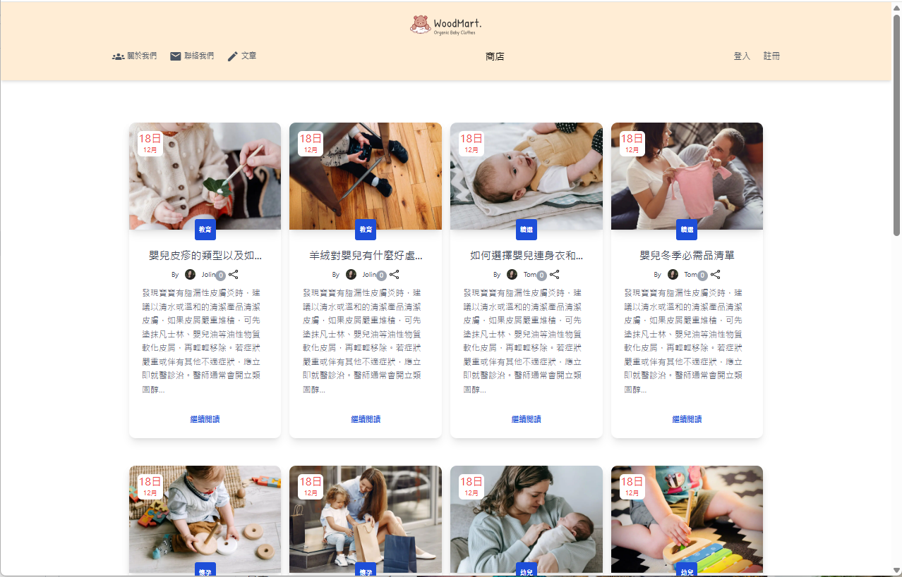

# 兒童商品網站

網站首頁

## 專案說明 
Demo Website:https://zaihello.github.io/2025-kidshop/#/shop

## 使用技術 
* 以 Vue 3 和 Vite架設開發 
* 使用 tailwindcss v3 作為 CSS 框架，以進行切版 
* Mokky 伺服器 RESTApi

## 使用套件 
* Vue 3 
* Vue Router 
* Vue Axios 
* Vee Validation 
* Tailwindcss v3 
* Swiper 
* Pinia 
* Sweetalert2

## 前台簡介

關於我們頁面

文章頁面

聯絡我們頁面

會員登入

會員註冊

商品詳細頁面

購物車

會員帳號

後台管理

